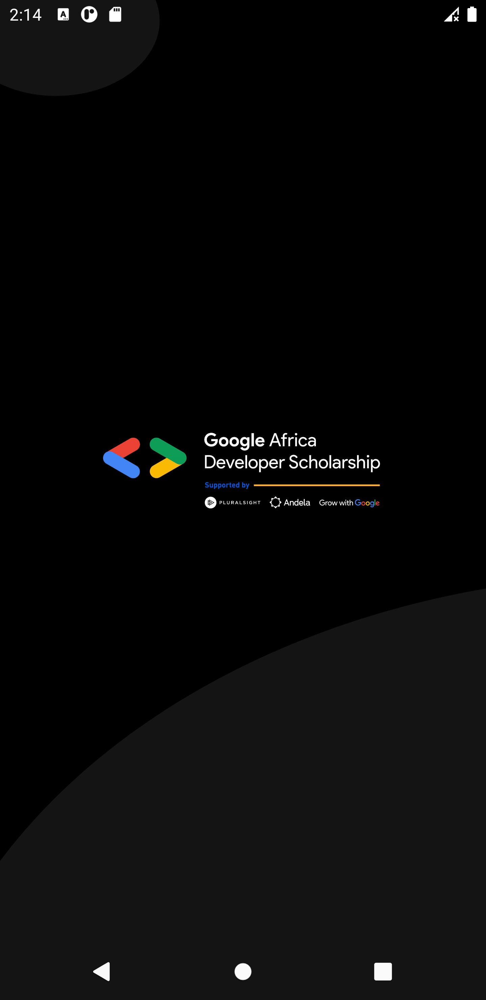
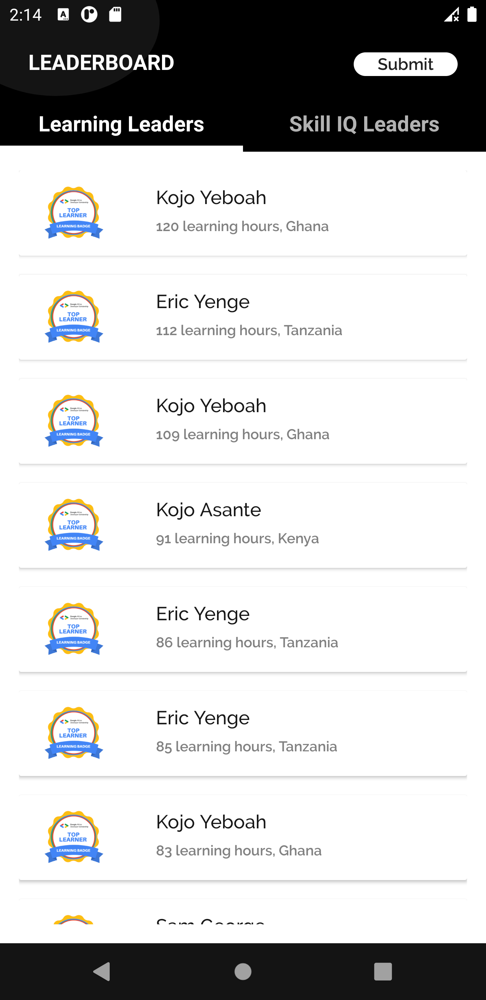
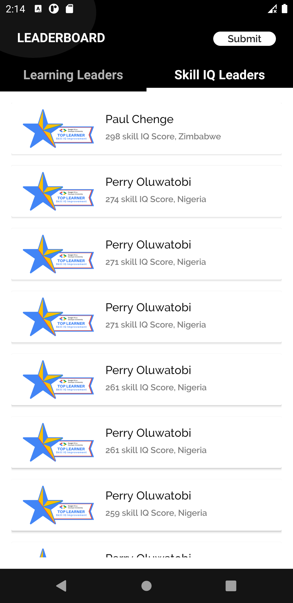
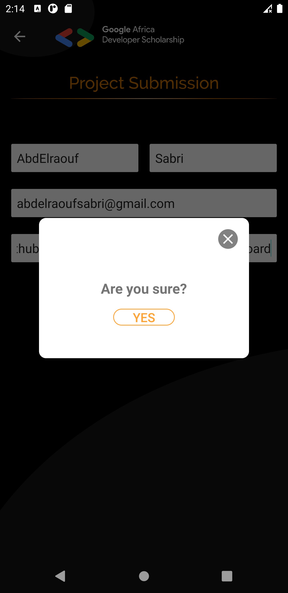
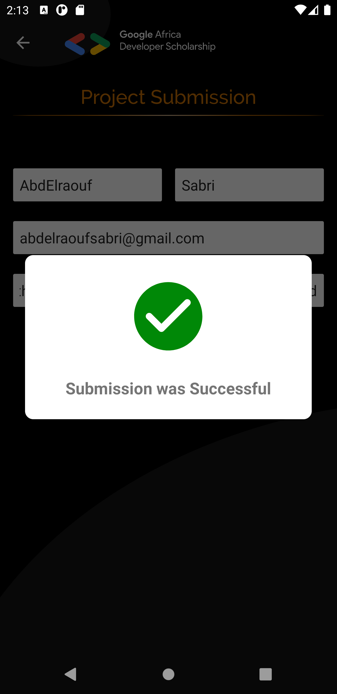
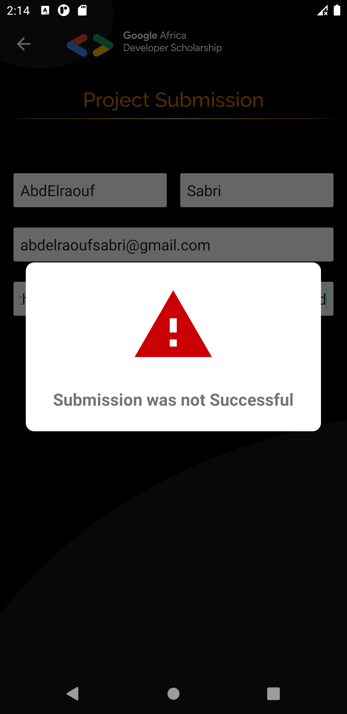

# GADS 2020 Leaderboard.
## Thank you GADS
I'd like to thank **Google**, **Andela**, **Pluralsight** and *every single individual* that helped in bringing this learning experience to Africa developers. Thank you!

I'm really honored to be part of this team of GREAT developers from all africa and overseas.

## Introduction
The mobile App will display **Top 20 learners in the Learning Leaders category** and **Top 20 learners in the Skill IQ Leaders category**. Also it will create a response in a google form with my information.

## Project summary

- splash screen

- Leaderboard
	- By Learning hours

	- By Skill IQ

- Submission

	- Confirmation

	- Success

	- Failure

# Conclusion
I enjoyed this project alot. Hoping it will be a great help to share it with the community.

Thank you